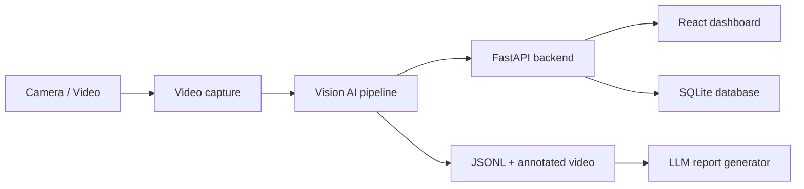

# EduVision

EduVision is a fixed-camera classroom monitoring prototype. It combines person
detection, multi-object tracking, behavior recognition, optional face
recognition, seat monitoring, a FastAPI backend, a React dashboard, and an LLM
report generator for post-session summaries.

The repository is currently organized as a local, multi-service development
project rather than a packaged production deployment. The fastest way to try the
end-to-end computer vision path is the Streamlit harness in
`services/streamlit_demo.py`.

## Current Capabilities

- Detect and track students from a video file, webcam, HTTP stream, or RTSP
  stream.
- Classify classroom behavior with a custom YOLO behavior model.
- Stabilize behavior states with temporal aggregation before exposing final
  labels.
- Detect off-task objects such as cell phones and associate them with student
  tracks.
- Optionally detect and recognize faces with InsightFace enrollments.
- Optionally monitor assigned seats and prioritize `away_from_seat` when the
  seat monitor confirms it.
- Export per-frame JSONL and annotated video from the Vision AI CLI.
- Aggregate JSONL into class and student summaries for report generation.
- Generate Markdown session reports with Gemini or OpenAI GPT.
- Persist students, sessions, attendance, behavior events, and generated reports
  through a FastAPI backend backed by local SQLite.
- Run a React/Vite dashboard against the backend, with mock fallbacks when the
  backend is unavailable.
- Evaluate end-to-end predictions against sparse or sampled ground truth.

## Architecture



Inside the Vision AI pipeline, the main steps are person detection, tracking,
behavior detection, optional face recognition, optional seat monitoring, and
temporal aggregation.

## Services

| Path | Purpose |
| --- | --- |
| `services/vision_ai` | Core per-frame CV pipeline and annotation helpers. |
| `services/backend_api` | FastAPI app, SQLite persistence, student enrollment, session lifecycle, reports. |
| `services/frontend` | React/Vite dashboard for sessions, students, reports, and settings. |
| `services/report_generator` | JSONL aggregation, prompt building, Gemini/GPT report generation. |
| `services/video_connection` | Real-time capture helpers for RTSP/webcam sources. |
| `services/streamlit_demo.py` | Local E2E harness up to pre-report session summary. |
| `tools/evaluate` | E2E accuracy conversion, evaluation, and performance benchmark tools. |
| `configs/services` | Module configs for detectors, tracking, behavior, seats, face recognition, reports. |
| `tests` | Unit and integration tests for temporal behavior, seat monitoring, reports, detectors, and E2E metrics. |

## Requirements

- Python 3.10.9 or newer.
- `uv` for the locked Python environment.
- Node.js 18 or newer for the frontend.
- Optional NVIDIA GPU with CUDA for faster inference.
- Optional Microsoft Visual C++ Build Tools on Windows if installing the face
  recognition extras manually. This repo's `pyproject.toml` pins a Windows
  InsightFace wheel through `uv`.

## Python Setup

Preferred setup:

```powershell
uv sync
```

`uv sync` installs the locked core CV and test environment from
`pyproject.toml`. Some service entry points also depend on the legacy
requirements files. Install these when you use the report generator or backend:

```powershell
# Report generator dependencies: loguru, google-generativeai, openai.
uv pip install -r requirements.txt

# Backend API dependencies: fastapi, uvicorn, python-multipart, requests.
uv pip install -r services\backend_api\requirements-api.txt
```

Install optional face-recognition dependencies:

```powershell
uv sync --extra face
```

Pip fallback:

```powershell
python -m venv .venv
.\.venv\Scripts\Activate.ps1
python -m pip install -r requirements.txt
```

## Frontend Setup

```powershell
cd services\frontend
npm install
```

## Model Weights

The checked-in demo weights are:

- `weights/behavior_yolo26n.pt` - default custom classroom behavior model.
- `weights/yolo26n.pt` - local YOLO26 person detector weight.

The Vision AI CLI defaults to `weights/behavior_yolo26n.pt` for behavior
classification. Ultralytics may download official model assets on first use if
a selected detector is not already available locally.

## Quick Start: Streamlit E2E Harness

This is the easiest local demo. It accepts an uploaded video or local camera,
runs the Vision AI pipeline, previews annotated frames, writes frame JSONL, and
creates a pre-report summary.

```powershell
uv run streamlit run services/streamlit_demo.py
```

Outputs are written under:

```text
outputs/streamlit/
```

For a quick CPU smoke test, use:

- Detector: `yolo26n` or `yolo11n`
- Tracker: `bytetrack_classroom`
- Device: `cpu`
- Skip object detector: enabled
- Max frames: 30 to 100

## Run Vision AI From CLI

Process a video and write frame-level JSONL:

```powershell
uv run python -m services.vision_ai.src.main `
  --source path\to\classroom.mp4 `
  --detector yolo26n `
  --tracker bytetrack_classroom `
  --behavior-model weights\behavior_yolo26n.pt `
  --output-jsonl outputs\session.jsonl `
  --max-frames 300 `
  --skip-objects
```

Process a webcam:

```powershell
uv run python -m services.vision_ai.src.main `
  --source 0 `
  --behavior-model weights\behavior_yolo26n.pt `
  --show
```

Enable face recognition and seat calibration:

```powershell
uv run python -m services.vision_ai.src.main `
  --source path\to\classroom.mp4 `
  --behavior-model weights\behavior_yolo26n.pt `
  --enrollment-path data\enrollments.json `
  --start-class
```

Useful Vision AI flags:

| Flag | Notes |
| --- | --- |
| `--source` | Video path, RTSP/HTTP URL, or webcam index. |
| `--detector` | `yolo11n`, `yolo11s`, `yolo26n`, or `yolo26s`. |
| `--tracker` | `bytetrack`, `bytetrack_classroom`, or `botsort`. |
| `--person-input-size` | Use `1280` for distant classroom students in Full HD video. |
| `--person-confidence` | Detection threshold passed to tracking. Default is low for classroom footage. |
| `--behavior-window` | Override temporal aggregation window size. |
| `--skip-objects` | Skip off-task object detector for faster smoke tests. |
| `--output-jsonl` | Write one JSON object per processed frame. |
| `--output-video` | Write annotated MP4. |
| `--show` | Display annotated frames with OpenCV. |

## Generate A Report From JSONL

Install report dependencies once if they are not already available:

```powershell
uv pip install -r requirements.txt
```

Set the API key for the provider you want to use:

```powershell
$env:GEMINI_API_KEY = "your-key"
$env:OPENAI_API_KEY = "your-key"
```

Generate a Vietnamese report with Gemini:

```powershell
uv run python -m services.report_generator.main `
  --source outputs\session.jsonl `
  --llm gemini `
  --language vi `
  --output outputs\report.md
```

Generate only the prompt, without calling an LLM:

```powershell
uv run python -m services.report_generator.main `
  --source outputs\session.jsonl `
  --print-prompt
```

Defaults live in:

```text
configs/services/report_generator/config.yaml
```

## Run Backend API

Install backend dependencies once if they are not already available:

```powershell
uv pip install -r services\backend_api\requirements-api.txt
```

Start the FastAPI backend:

```powershell
uv run uvicorn services.backend_api.main:app --reload --host 0.0.0.0 --port 8000
```

Open the API docs:

```text
http://localhost:8000/docs
```

The backend stores local data in:

```text
data/eduvision.db
data/enrollments.json
data/avatars/
data/reports/
```

Important endpoints:

| Method | Endpoint | Purpose |
| --- | --- | --- |
| `GET` | `/api/health` | Health check. |
| `GET` | `/api/students` | List enrolled students. |
| `POST` | `/api/students` | Create/update a student with optional face image upload. |
| `DELETE` | `/api/students/{student_id}` | Delete a student. |
| `GET` | `/api/sessions` | List sessions. |
| `POST` | `/api/sessions/start` | Start a class session. |
| `POST` | `/api/sessions/{session_id}/end` | End a class session. |
| `GET` | `/api/sessions/{session_id}/attendance` | Session attendance summary. |
| `GET` | `/api/sessions/{session_id}/events` | Behavior events. |
| `POST` | `/api/sessions/{session_id}/events` | Push batched Vision AI events. |
| `GET` | `/api/sessions/{session_id}/summary` | Aggregated session behavior summary. |
| `POST` | `/api/reports/generate` | Generate and save a backend report. |
| `GET` | `/api/reports/{session_id}` | Load a saved backend report. |

## Push Vision Events To Backend

1. Start the backend.
2. Create a session from the API or frontend.
3. Run the event pusher against that active session:

```powershell
uv run python -m services.backend_api.event_pusher `
  --session-id 1 `
  --source path\to\classroom.mp4 `
  --api-url http://localhost:8000 `
  --detector yolo26n `
  --behavior-model weights\behavior_yolo26n.pt `
  --max-frames 300
```

The pusher wraps `VisionPipeline`, buffers `final_behavior` events, and sends
them to `/api/sessions/{session_id}/events`.

## Run Frontend Dashboard

Start the backend first if you want real data. Then:

```powershell
cd services\frontend
npm run dev
```

Open:

```text
http://localhost:3000
```

Vite proxies `/api` to `http://localhost:8000`. If the backend is unreachable,
the frontend falls back to mock data for read-only views.

## Evaluation

Evaluate pipeline JSONL against a ground-truth JSONL:

```powershell
uv run python -m tools.evaluate.evaluate `
  --predictions outputs\session.jsonl `
  --ground-truth data\ground_truth\session.jsonl `
  --fps 25 `
  --bbox-iou 0.5 `
  --output outputs\evaluation.json
```

Run a performance benchmark:

```powershell
uv run python -m tools.evaluate.benchmark `
  --source path\to\classroom.mp4 `
  --behavior-model weights\behavior_yolo26n.pt `
  --output-jsonl outputs\session.jsonl `
  --metrics-output outputs\performance.json `
  --warmup-frames 5
```

See `tools/evaluate/README.md` for the accepted ground-truth formats and metric
details.

## Tests

Run the Python test suite:

```powershell
uv run pytest
```

The tests cover temporal behavior aggregation, seat monitoring, report
aggregation, person detection behavior, and E2E metrics.

## Repository Layout

```text
EduVision/
  configs/                 Service configuration files.
  data/                    Local runtime data, ignored by git.
  outputs/                 Generated JSONL, summaries, videos, metrics.
  scripts/                 Utility scripts such as auto enrollment.
  services/
    backend_api/           FastAPI + SQLite backend.
    frontend/              React/Vite dashboard.
    report_generator/      JSONL aggregation and LLM report generation.
    streamlit_demo.py      Local E2E harness.
    video_connection/      Real-time capture helpers.
    vision_ai/             Detection, tracking, behavior, face, and seat logic.
  tests/                   Pytest suite.
  tools/
    evaluate/              E2E evaluation and benchmark tools.
  weights/                 Local model weights.
  pyproject.toml           uv project metadata and dependencies.
  requirements.txt         pip fallback dependencies.
```

## Notes And Limitations

- The production database described in earlier drafts is not wired in here;
  the active backend uses SQLite.
- The Streamlit harness stops at pre-report summary generation. Use
  `services.report_generator.main` to call an LLM from a JSONL file.
- Face recognition is optional and heavier than the default behavior-only path.
- Real-time RTSP sources may need lower input size, frame skipping, or the
  threaded capture helpers in `services/video_connection`.
- Generated runtime data and most model weights are intentionally ignored by
  git.
