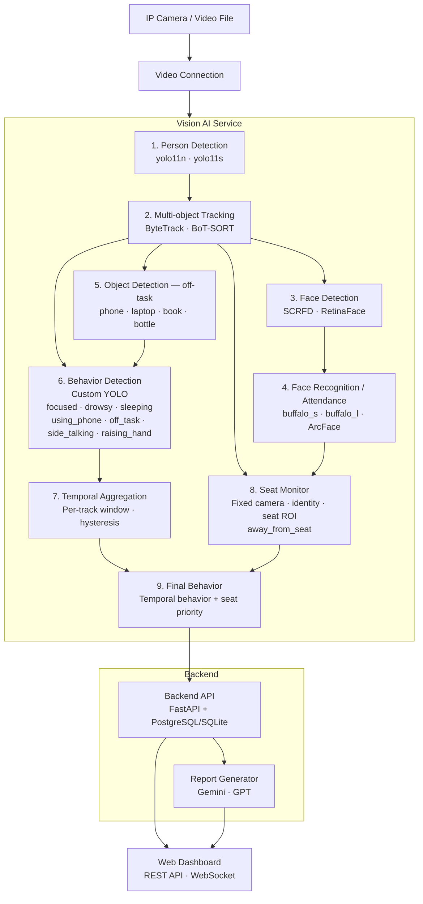

# EduVision — AI Classroom Monitoring System

> An intelligent classroom monitoring system that uses computer vision and AI to automate attendance, track student engagement, analyze behaviors, and generate post-session reports.

---

## 1. Project Name

**EduVision**

---

## 2. Short Description

EduVision is an AI-powered classroom monitoring pipeline built for higher education environments. A camera mounted at an elevated position in the classroom feeds live video into the system, which automatically identifies students, tracks their positions, analyzes behavioral states (focused, drowsy, using phone, away from seat), monitors basic instructor activity, and produces a structured session report using a large language model (LLM). The goal is not to replace human judgment but to provide objective, data-driven observational support for instructors and administrators.

---

## 3. Key Features

| Feature | Description |
|---|---|
| **Automatic Attendance** | Identifies students via face recognition and logs entry/exit times |
| **Student Tracking** | Multi-object tracking assigns a persistent ID to each student throughout the session |
| **Behavior Analysis** | Classifies per-student states: focused, drowsy, using phone, absent from seat, side-talking |
| **Session Statistics** | Aggregates per-student and class-wide engagement metrics over time |
| **LLM Report Generation** | Generates a human-readable session summary using Gemini or GPT |
| **Web Dashboard** | React-based frontend for live monitoring, managing students, and viewing reports |

---

## 4. System Architecture



The system is organized as **independent microservices** that communicate via REST API and WebSockets:

- **video_connection** — camera/stream ingestion and frame distribution
- **vision_ai** — core CV pipeline: detection → tracking → face recognition → object detection → behavior detection → temporal aggregation → seat monitoring
- **backend_api** — persists events to the database, exposes a REST API, and manages WebSocket broadcasting
- **report_generator** — queries the database and calls an LLM to produce session reports
- **frontend** — web dashboard (React) for live monitoring, managing students, and historical reports

---

## 5. Technologies Used

Each CV module supports multiple interchangeable backends. The active backend is selected via config or CLI flag.

### 5.1 Person Detection

| Option | Model | Notes |
|---|---|---|
| **`yolo11n`** *(default)* | YOLOv11-nano | Fastest, lowest VRAM — suitable for CPU or low-end GPU |
| **`yolo11s`** | YOLOv11-small | Better accuracy, moderate GPU recommended |

### 5.2 Multi-object Tracking

| Option | Algorithm | Notes |
|---|---|---|
| **`bytetrack`** *(default)* | [ByteTrack](https://github.com/ifzhang/ByteTrack) | Fast, robust; start here |
| **`botsort`** | [BoT-SORT](https://github.com/NirAharon/BoT-SORT) | Better ID consistency when ByteTrack produces ID switches |

### 5.3 Face Detection & Recognition

| Option | Model | Notes |
|---|---|---|
| **`scrfd`** *(default)* | SCRFD (InsightFace) | Fast, lightweight, good for small faces from overhead camera |
| **`buffalo_s`** *(default)* | InsightFace `buffalo_s` | Lightweight, suitable for real-time on modest GPU |

### 5.4 Object Detection (Off-task Behavior)

Runs a COCO object detector for off-task objects and associates each object with the canonical student track. A detected phone can override the frame-level behavior prediction for that track before temporal aggregation.

### 5.5 Behavior Detection and Temporal Aggregation

A custom YOLO detection model predicts one visual behavior box per visible student. Behavior boxes are matched to canonical person tracks, then aggregated independently per `track_id` using a temporal window.

**Output behavior states:** `focused`, `drowsy`, `sleeping`, `using_phone`, `off_task`, `side_talking`, `raising_hand`, `away_from_seat`.

### 5.6 Backend, LLM & Frontend

- **Backend Framework**: FastAPI (Python)
- **Database**: SQLite (Development)
- **LLM Report Generation**: Google Gemini or OpenAI GPT
- **Frontend**: React (Vite) + TailwindCSS

```text
outputs/streamlit/
```

## 6. Installation & Running the System

- Detector: `yolo26n` or `yolo11n`
- Tracker: `bytetrack_classroom`
- Device: `cpu`
- Skip object detector: enabled
- Max frames: 30 to 100

- Python 3.10 or higher
- Git
- Microsoft Visual C++ Build Tools 14+ (required for `insightface` compilation on Windows)

### Setup Instructions

```powershell
# 1. Clone the repository
git clone <repository-url>
cd EduVision

# 2. Create and activate virtual environment
python -m venv ev
ev\Scripts\activate   # Windows
# source ev/bin/activate  # macOS / Linux

# 3. Install backend dependencies (with face recognition support)
pip install -r requirements.txt
pip install -r requirements-face.txt

# 4. Install frontend dependencies
cd services/frontend
npm install
cd ../..

# 5. Copy and configure environment variables
cp configs/.env.example configs/.env
# Edit configs/.env — set your GEMINI_API_KEY / OPENAI_API_KEY
```

### Running the Services

To run the full end-to-end system, you will need two terminal windows:

**Terminal 1 (Backend API & Vision Pipeline Pipeline Manager)**
```powershell
# Ensure virtual environment is activated
ev\Scripts\activate
python -m uvicorn services.backend_api.main:app --host 0.0.0.0 --port 8000
```

**Terminal 2 (Frontend Dashboard)**
```powershell
cd services/frontend
npm run dev
```

Open `http://localhost:5173` in your browser. From the dashboard, you can:
- Add students and upload avatar images for Face Recognition.
- Start the AI pipeline using your webcam or a video file.
- View real-time tracking, behavior classification, and live stream.
- Generate LLM-powered end-of-session reports.

---

## 7. Directory Structure

```text
EduVision/
├── configs/                    # Configuration files and environment templates
├── data/                       # Local database, uploaded videos, model weights (gitignored)
├── services/                   # Microservices
│   ├── video_connection/       # Stream processing logic (realtime_demo)
│   ├── vision_ai/              # Core computer vision pipeline
│   ├── backend_api/            # FastAPI REST backend + WebSocket manager
│   ├── report_generator/       # LLM-based report generation (Gemini / GPT)
│   └── frontend/               # React Web dashboard
├── ev/                         # Python virtual environment (gitignored)
├── requirements.txt            # Python dependencies
├── requirements-face.txt       # Advanced face recognition dependencies
└── README.md
```

---

## 8. Main APIs

### Students
- `GET /api/students` - List all registered students
- `POST /api/students` - Register a new student (with face images)
- `DELETE /api/students/{student_id}` - Delete a student

### Pipeline & Sessions
- `POST /api/pipeline/start/{session_id}` - Start the AI analysis pipeline for a specific stream/video
- `GET /api/pipeline/status` - Check if the pipeline is running
- `POST /api/upload_video` - Upload an MP4 video to use as a camera source
- `GET /api/sessions` - List all recorded sessions

### Reports
- `POST /api/reports/generate` - Trigger LLM report generation for a session
- `GET /api/reports/{session_id}` - Retrieve the generated report

### WebSockets
- `ws://localhost:8000/ws/events` - Real-time stream of parsed behavioral events and tracking data

Full API documentation (Swagger UI) is available at `http://localhost:8000/docs` when the backend is running.

```text
EduVision/
  configs/                 Service configuration files.
  data/                    Local runtime data, ignored by git.
  outputs/                 Generated JSONL, summaries, videos, metrics.
  scripts/                 Utility scripts such as auto enrollment.
  services/
    backend_api/           FastAPI + SQLite backend.
    frontend/              React/Vite dashboard.
    report_generator/      JSONL aggregation and LLM report generation.
    streamlit_demo.py      Local E2E harness.
    video_connection/      Real-time capture helpers.
    vision_ai/             Detection, tracking, behavior, face, and seat logic.
  tests/                   Pytest suite.
  tools/
    evaluate/              E2E evaluation and benchmark tools.
  weights/                 Local model weights.
  pyproject.toml           uv project metadata and dependencies.
  requirements.txt         pip fallback dependencies.
```

## Notes And Limitations

- The production database described in earlier drafts is not wired in here;
  the active backend uses SQLite.
- The Streamlit harness stops at pre-report summary generation. Use
  `services.report_generator.main` to call an LLM from a JSONL file.
- Face recognition is optional and heavier than the default behavior-only path.
- Real-time RTSP sources may need lower input size, frame skipping, or the
  threaded capture helpers in `services/video_connection`.
- Generated runtime data and most model weights are intentionally ignored by
  git.
